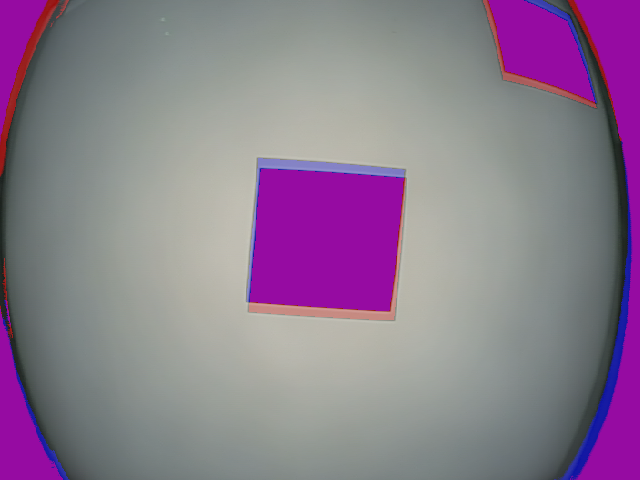
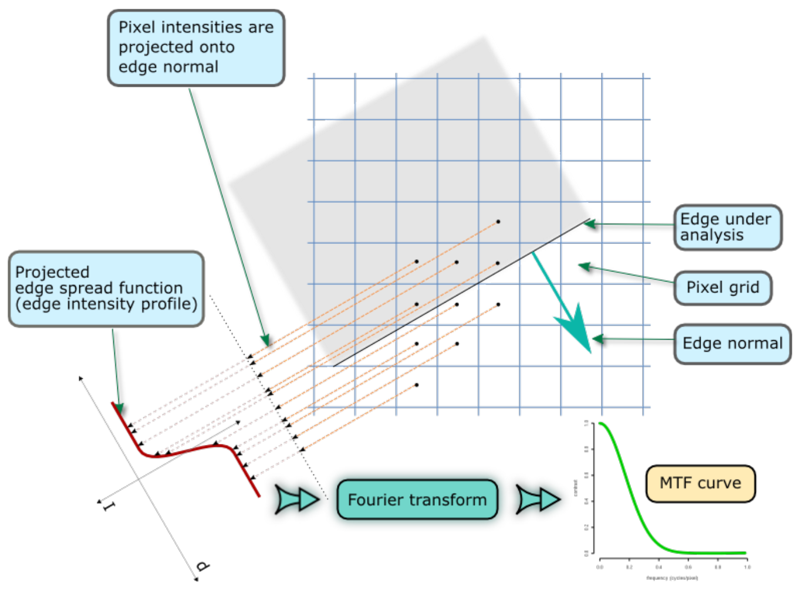
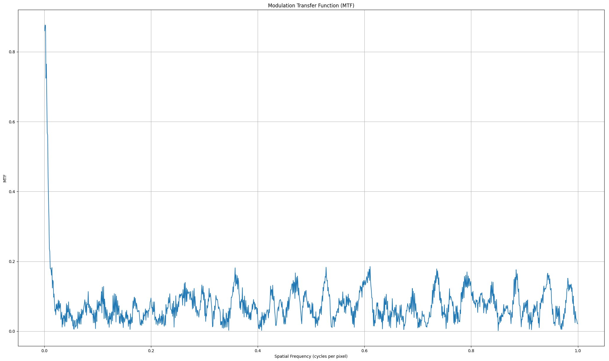
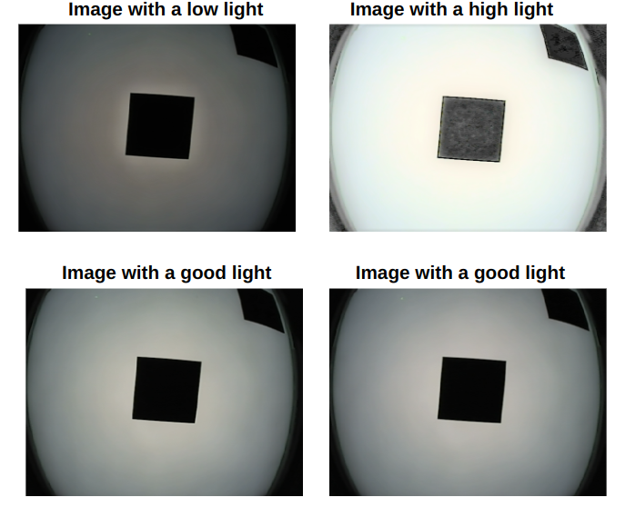
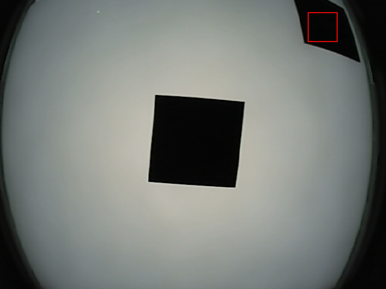
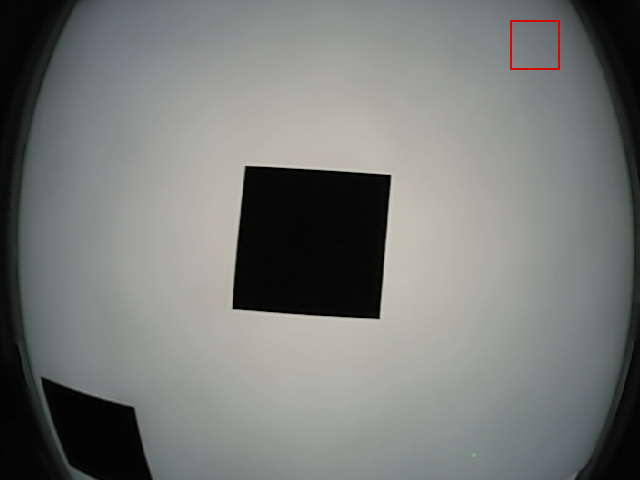

# Bosch Hackathon - ADAS Camera Image Quality Evaluation
## Introduction
This repository is dedicated to the evaluation of ADAS (Advanced Driver Assistance Systems) camera images for the Bosch Hackathon. The goal is to assess the quality of the images captured by ADAS cameras and ensure they meet the required standards. All images in this dataset are standardized to be 640 by 480 pixels.

## Contents

<div style="column-count: 2;">

* [**Guides**](#guides)

* [**Evaluation categories**](#evaluation-categories)
  <br>&nbsp;&nbsp;&nbsp; 1. [Centering](#1-centering)
  <br>&nbsp;&nbsp;&nbsp; 2. [Focus](#2-focus)
  <br>&nbsp;&nbsp;&nbsp; 3. [Lighting](#3-lighting)
  <br>&nbsp;&nbsp;&nbsp; 4. [Orientation](#4-orientation)

* [**Quick Start**](#quick-start)
  <br>&nbsp;&nbsp;&nbsp; a. [Installation](#installation)
  <br>&nbsp;&nbsp;&nbsp; b. [User Interface](#user-interface)
  <br>&nbsp;&nbsp;&nbsp; c. [Run from terminal](#run-from-terminal)

</div>


## Guides

* **Consulta también la carpeta `guides/` para la versión en formato `.pdf` de la guía del usuario, disponible en inglés y español.**

* **Also see `guides/` for the `.pdf` version of the user guide, available in English and Spanish.**

## Evaluation Categories
The image evaluation process is divided into four main categories:

### 1. Centering
This category assesses whether the subject of the image is properly centered. An image is considered centered when the main subject or region of interest is well-aligned within the frame.

The following figure shows two overlaping images; the reference on the back and with the black features painted in blue, and the testing image `12.PNG` in the front with the black sections painted in red.
<p align="center">
  
</p>
The figure shows how a part of the images' reference figures overlap, and also helps to distinguish how the offset from the reference presents itself in some images.

The way in which we asses the centering of an image respect to the reference is by performing the following operations:

1. Load the reference and comparison images
2. Convert the images to Numpy arrays
3. Calculate cross-correlation betweent the two images
4. Find the location of the maximum correlation peak
5. Calculate offsets from the center
6. Check if the offset is inside the desired limits

Via this method we may determine if the new image is compliant with the tolerances, all comparing to the reference image.

### 2. Focus
The focus evaluation checks the sharpness and clarity of the image. It helps determine whether the camera captured a clear and focused image or if blurriness or distortion is present. As requested by the specifications, the focus is evaluated in a region of the image in which the center reference square transitions to the white section of the picture. Note that the reference square has an angle in order to be able to analyze the quality of focus of the image at different parts of the image (or the lense itself). To learn more about the reason behind the reference shapes, visit the ISO page for the [ISO-12233:2023](https://www.iso.org/obp/ui/en/#iso:std:iso:12233:ed-4:v1:en) standard and older versions.

The method in which we based our solution is the MTF50 stadard evaluation, as suggested by Bosch. See the following diagram as an explanation of the process:
<p align="center">
  
</p>
The process for the analysis is given by the following steps:

1. Read the Image and Convert to Grayscale Format.
2. 'Project' the intensity of the pixels along one of the edges into a graph, which should look like a sigmoid function. This graph shows the change of intensity of the pixels as we go from the black, reference square section, to the white section.
4. In order to get a representation of the rate of change of the pixel intensity from the balck to the white area, derive the function given by the projection.
3. Via a Fast Fourier Transform, decompose the derivative projection.
4. Plot the `MTF`-like decomposition of the rates of change. 

<p align="center">
  
</p>

The graph expresses the spatial frequency, given in cycles per pixel, of the image for that given region. By checking the image when the MTF is at 0.50, it provides the cycles per pixel at a point where the contrast of the image is reduced by 50%.

### 3. Lighting
The lighting test measures pixel intensity to assess image brightness, offering a reliable indicator. Test limits range from a minimum of 170 to a maximum of 250. This test evaluates if the lighting in a set of 20 images complies with these limits. Passing signifies meeting standards, while failing suggests deviation. Proper lighting is pivotal for clear and precise image analysis.

<p align="center">
  
</p>

The way in which we asses the lighting of an image respect to the reference is by performing the following operations:

1. Read the Image and Convert to Grayscale Format. 
2. Apply Binary Thresholding.
3. Find the Contours of the shape.
4. Extract the central portion of the object to reduce computational complexity.
5. Draw Contours on the Original Image.
6. Collect Contour Data.
7. Calculate Mean RGB Color.
8. Evaluate Lighting regarding the calculation. 

By employing this method, we can ascertain whether the new image complies with the established tolerances, all while comparing it to the reference image.


### 4. Orientation
Orientation is crucial for image interpretation. Images must be in the correct orientation to facilitate accurate analysis. To be considered correctly oriented, an image must adhere to the following guidelines:

One of the black reference squares should be positioned at the center of the image.
The other black reference square should be at the top right corner of the image.
If the top right corner square is not in its designated position, the image is considered to have an incorrect orientation. Tests for correct orientation involve defining a "window" where the top right black reference square should be if oriented correctly. The system then checks if the average brightness of this region is as low as it should be for the square to be considered the reference square.

Here are two examples of images being checked via this method:

**Valid orientation**
<p align="center">
  
</p>

This image is considered to be valid, as when the top right red region is checked for averag black and white instensity of the channel, it lands below the given threshold. _Note that the threshold may be determined by heuristics, but it may also be adapted for it to consider the center of the image as a basis to determine the threshold, since in case that the image is over or under exposed the threshold should change to acount for the variation._

**Invalid orientation**
<p align="center">
  
</p>

In this second case the image is considered invalid, since the mean of pixel instensity in the specified region would be below the given threshold.

## Quick start

### Installation
**Prerequisites:**
Python3

1. Clone the repository to your computer.

2. To install the full requirements of the application, use the following command:
```python
pip install -r requirements.txt
```
3. Create `paths.py` inside `src/` directory. It should contain something like the following:
```python
main_path = '/<path_to_repo>/ImageQualityEvaluation_Bosch'
```  

## User Interface
To make this project user friendly, a simple GUI application is provided for its usage and there is also the possiblity of executing the project via Windows Command Prompt / Linux terminal according to the needs of our users. Here it will be included some brief explanations on how to use each one of them. Furthermore, after running the project, a csv file which contains all the evaluation results is created. 

## Run from Terminal
Use one of the following formats for calling the evaluation on a directory of images without using the UI:

**Option 1:** Provide the path to the directory of images you want to evaluate, and the name of the reference file.
```bash
python3 imageEvaluation.py <path_to_images> <filenme>
```
**Option 2:** Only provide the path to the directory and take the reference file as the default of `REF_23.PNG`.
```bash
python3 imageEvaluation.py <path_to_images>
```

**Option 3:** Provide no arguments to the programm. Take the default path of `../data/` and the reference image as the default of `REF_23.PNG`.
```bash
python3 imageEvaluation.py
```

Any of these executions produces a `.csv` file that contains the results of the evaluation for all the images, compared to the reference file.

### Contribute
We welcome contributions from the Bosch Hackathon community. If you have ideas for improving the image quality evaluation process or want to contribute code or documentation, please feel free to open an issue or submit a pull request.

### Authors

- David Ortiz Cota
- Jorge Alejandro González Díaz
- Jose María Soto Valenzuela
- Pablo Vargas Cárdenas

### License

**AWAITING CHANGES**
This project is licensed under the MIT License, which means you are free to use and modify the code as long as you comply with the license terms. 